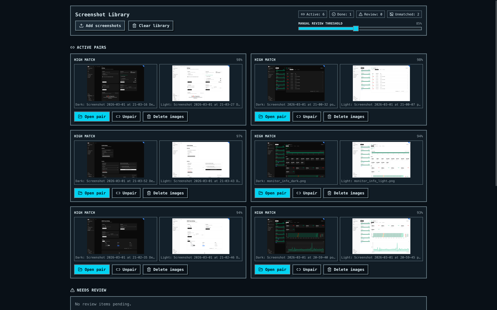
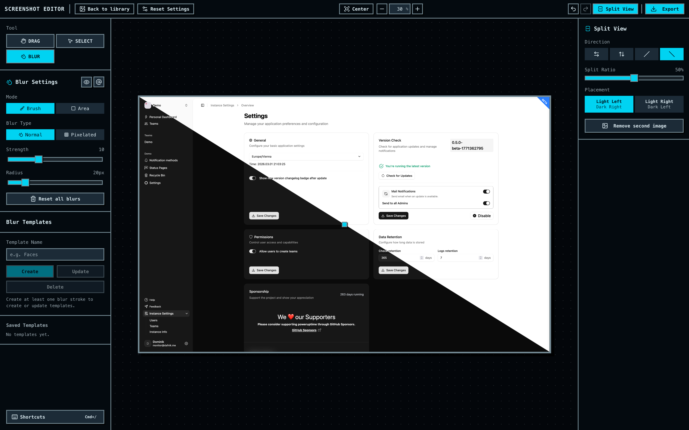

# Screenshot Editor

A desktop-first React app for anonymizing and comparing screenshots.

It supports two workflows:

- direct mode for 1-2 uploaded screenshots
- library mode for bulk uploads with pair matching, review, and queue-based editing

## Screenshots

### Library workflow



### Editor workflow



## Features

- Brush and box blur tools
- Split-view comparison (vertical, horizontal, and diagonal)
- Auto-blur helpers (email, phone, custom text via OCR)
- Library ingestion for larger screenshot batches
- Auto-pairing with manual review threshold control
- Review queue and unmatched-image handling
- Keyboard shortcuts for common editing actions
- Export flow with library progress tracking (active vs done pairs)

## Keyboard Shortcuts

`MOD` means `Cmd` on macOS and `Ctrl` on Windows/Linux.

### General

- Shortcuts modal: `MOD + /`
- Undo: `MOD + Z`
- Redo: `MOD + Y` or `MOD + Shift + Z`
- Open file dialog: `MOD + U`
- Export: `MOD + E`
- New project / Back to library: `MOD + N`

### Editor

- Pan: `Alt + Drag` (or middle mouse drag)
- Zoom: mouse wheel / trackpad scroll
- Zoom step: `MOD + Left Arrow` / `MOD + Right Arrow`
- Switch tool (Select/Blur): `MOD + T`
- Copy selected blur boxes: `MOD + C`
- Paste copied blur boxes: `MOD + V`
- Delete selected blur boxes: `Backspace`

### Blur

- Toggle blur type: `MOD + B`
- Open auto blur menu: `MOD + A`
- Toggle outlines: `MOD + O`
- Radius step: hold `MOD + R`, then press `Left Arrow` / `Right Arrow` or `J` / `K`
- Strength step: hold `MOD + S`, then press `Left Arrow` / `Right Arrow` or `J` / `K`
- Load template slot: `MOD + 1-9`
- Temporary alternate blur shape while drawing: hold `Shift`

### Split View

- Cycle split direction: `MOD + D`
- Toggle light/dark placement: `MOD + P`

### Modal

- Close open modal: `Escape`

## Tech Stack

- React 19 + TypeScript
- Vite 7
- Zustand for editor state
- Vitest + Testing Library
- Tailwind CSS 4 + Radix UI primitives
- Tesseract.js for OCR-based detection

## Getting Started

### Prerequisites

- Node.js 20+
- `pnpm` (project uses `pnpm@10`)

### Install

```bash
pnpm install
```

### Run locally

```bash
pnpm start
```

Open the local URL printed by Vite (typically `http://localhost:5173`).

## Available Scripts

- `pnpm start` - start dev server
- `pnpm build` - build production bundle
- `pnpm preview` - preview built app locally
- `pnpm test` - run test suite once
- `pnpm test:watch` - run tests in watch mode
- `pnpm typecheck` - run TypeScript checks
- `pnpm format` - format all files
- `pnpm format:check` - verify formatting

## Usage Notes

- Uploading more than 2 screenshots enters library mode.
- Uploading 1-2 screenshots enters direct editor mode.
- The app is desktop-only.
